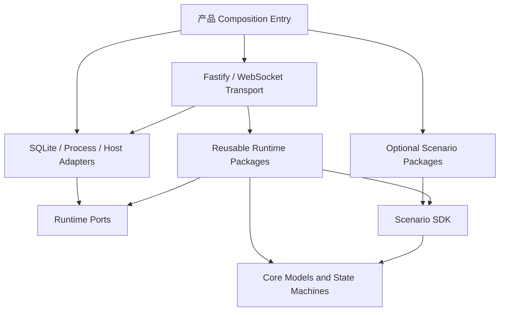

# Runtime 依赖图与提取边界

本文记录 2026-08-29 当前底座源码的实际依赖方向，用于指导 Runtime 从 `apps/server` 逐片提取。它描述的是
代码事实和允许的方向，不是按目录名称推测职责。

## 当前依赖事实

`apps/server/src` 当前有 102 个非测试 TypeScript 文件。其中 17 个直接依赖 Fastify，50 个直接依赖
SQLite/Drizzle 或 Server 数据库模块，8 个依赖通用 Scenario SDK。产品入口 `main.ts` 可以选择安装具体
Scenario Package，但 packages 与通用 Server 生产模块由 `verify:foundation` 禁止反向依赖应用或具体场景。

workspace 包依赖当前无环。原 `llm → extension → reasoning-core → llm` 循环已经拆除：模型 Provider Contract
由 `llm` 唯一持有，`extension` 只保留兼容类型转导并继续拥有工具发现/执行 Contract；`reasoning-core`
删除未被源码使用的模型依赖。底座边界门禁现在会遍历 workspace package graph，后续新增任何包循环都会失败。

强制方向如下：

- Product Composition 可以选择应用和 Scenario，但 Runtime、Core 与通用 Adapter 不能反向依赖 Product。
- Fastify request/reply、SQLite row、Drizzle schema 和桌面 API 只存在于 Transport/Adapter/Composition。
- Runtime 通过 Store、Event、Clock、ID、Model Provider、Execution 和 Tool 等端口工作。
- Scenario Package 只能通过 Scenario SDK 装配；底座不能解释具体目标、协议、漏洞或工具语义。

## 模块分类与提取顺序

| 区域 | 当前代表模块 | 目标归属 | 处理顺序 |
| --- | --- | --- | --- |
| Product Composition | `main.ts`, `security-agent-foundation.ts` | `apps/server` | 保留，只缩减装配职责 |
| Transport | `*-routes.ts`, 各模块的 `register*Routes` | `apps/server` | 与 Runtime 类拆开，不移入 packages |
| Persistence Adapter | `stores/*`, `db/*`, `Sqlite*Store` | `apps/server` | 实现 packages 定义的端口 |
| Model Runtime | Admission、预算、重试、熔断、调用审计 | `packages/model-runtime` | Admission 与 Execution 主体已提取 |
| Cognitive Runtime | Planner、Observer、Worker loop、上下文蒸馏 | `packages/cognitive-runtime` | 上下文、快照、评估、唤醒与循环调度已提取 |
| Scenario Runtime | Run/Work/Lease/Recovery、调度协调 | 后续 reusable package | 在 Event Store 端口稳定后提取 |
| Execution/Tool/Evidence | 已有对应 packages | 现有 packages | 只修正反向依赖，不制造重复包 |

## 已完成切片：Model Admission 与 Execution Runtime

第一片已经从 `model-admission-controller.ts` 提取到 `@traceforge/model-runtime`：

- package 拥有认知模型角色、调用上下文、资源策略、准入状态、Store/Event 端口和准入控制器；
- Server 文件只保留 SQLite row 映射、`SqliteModelAdmissionStore` 和 Fastify 查询路由；
- `model-execution-runtime.ts` 从新 package 消费并兼容导出原有上下文类型；
- package 内存 harness 在没有 Fastify、SQLite 和 Scenario Package 的情况下验证优先级与 Run 级并发；
- 现有 SQLite 集成测试继续验证重启中断恢复和记录语义。

第二片已经从 `model-execution-runtime.ts` 提取到同一 package：

- package 拥有 Provider 路由、估算与 Run 预算协议、重试、熔断、超时/取消和模型调用事件生命周期；
- `ModelJsonProviderPort` 与 `ModelExecutionStore` 是结构化端口，新 package 不依赖 `llm`、`extension`、Fastify
  或 SQLite，因此没有加入现有 workspace 循环；
- SQLite Adapter 继续用事务完成预算预留，保证并发调用不能绕过 Run 上限；Fastify 只查询调用与用量投影；
- package 内存 harness 验证 Provider 回退、熔断、预算和超时，原 Server 集成测试继续验证 SQLite、事件顺序、
  活跃调用取消和重启恢复。

## 已完成切片：Cognitive Context、Snapshot、Evaluation、Wake-up 与 Loop

第一个 Cognitive Runtime 切片已经从 `cognitive-context-distiller.ts` 提取到 `@traceforge/cognitive-runtime`：

- package 拥有 Run/Evidence/Worker 上下文预算、确定性裁剪、遗漏清单和语义指纹计算；
- Planner、Observer 与 Structured Worker 直接消费 package，Server 文件只保留 SQLite cursor Adapter 和兼容导出；
- package 只依赖通用 Evidence、Orchestration 与 Worker Contract，不依赖 Fastify、SQLite、LLM Provider、应用或具体 Scenario；
- 无 Server harness 验证跨租约归属变更的指纹稳定性、Run/Graph/Event 裁剪、Worker transcript 预算和非法预算拒绝。

第二个 Cognitive Runtime 切片已经从 `cognitive-context-snapshots.ts` 提取到同一 package：

- package 拥有快照 Prepare/Complete/Fail/Recovery 状态转换、输入/输出幂等校验、请求指纹和 replay 编排；
- `CognitiveSnapshotPersistencePort`、`CognitiveSnapshotEventPort` 与 `CognitiveSnapshotModelPort` 隔离持久化、实时协议和模型实现；
- Server 的 `SqliteCognitiveSnapshotStore` 现在是 Persistence Adapter 与兼容 facade，Fastify 继续只负责查询、就绪门禁和 HTTP 状态映射；
- 内存 harness 验证重复准备、冲突输入/输出、终态保护、重启中断和成功/失败 replay；原 SQLite 与事件流测试继续验证行映射和投影兼容性。

第三个 Cognitive Runtime 切片统一了 Evaluation 生命周期：

- `CognitiveEvaluationRunner` 只编排“准备快照—调用模型端口—解析决策—完成或失败”；
- Planner、Observer 与 Structured Worker 删除各自重复的 try/complete/fail 流程，并通过通用 Snapshot Port 消费底座；
- 模型路由上下文、request/prompt、Zod 决策 schema 和完成 outcome policy 全部由调用方注入，Runtime 不解释任何具体策略；
- 无 Server harness 验证模型错误和解析错误都进入失败终态、成功结果携带注入的完成策略，以及无持久化宿主运行。

第四个 Cognitive Runtime 切片统一了 Wake-up 与语义去重边界：

- `BlackboardChangeBus` 与变更 Contract 已移入 package，只承载提交后的唤醒提示，持久化 Store 仍是事实来源；
- `CognitiveContextCursorPort` 隔离 durable cursor，`CognitiveWakeGate` 统一 SQLite 与无持久化宿主的语义指纹去重；
- Observer 不再持有自己的 volatile cursor 分支，Server 的 cursor 文件只实现 SQLite Adapter；
- 无 Server harness 验证监听器故障隔离、退订、consumer/run 级游标隔离和 durable cursor 委派。

第五个 Cognitive Runtime 切片统一了循环调度生命周期：

- `CognitiveLoopScheduler` 只管理启动、wake 合并、单 tick 所有权、停止排空、正常轮询与错误退避；
- Planner 和 Observer 删除重复的 timer/running/activeTick/wakeRequested 状态机，继续公开原有 start/wake/stop 行为；
- Run 枚举、评估策略、Prompt、决策 Schema 和决策应用仍由注入的 tick 负责，Runtime 不解释 Scenario；
- 无 Server harness 验证 wake 风暴只追加一轮、tick 不重叠、stop 等待在途工作且不重启，以及 tick/轮询错误退避。

## 已完成切片：Provider-to-Host Capability Broker

第一片已在 `worker-runtime` 建立无场景语义的 `ProviderCapabilityBroker`：

- Tool Host 注入可信 Case/Run/Work/Worker/Lease/Scope 与有效权限，Provider 不能自报或覆盖归属；
- Authorization、Receipt 和 Capability Handler 都是端口，Core 不认识 URL、文件、浏览器或任何具体动作；
- 统一幂等 replay、跨进程 generation replay、调用深度、全局/Provider 并发、请求/响应字节、租约和超时限制；
- 中性 harness 验证授权、Evidence refs、拒绝/审批 Receipt、并发合并、边界拒绝和 Abort。

第二片已把唯一允许的反向方法 `host.capability.call` 接入本地 stdio 与 Execution Node Provider Client：

- Provider 只提交 parent request、能力、动作、输入和幂等键，协议拒绝任何额外归属字段；
- Client 只从仍在途的 `tools.call` 读取可信 Tool 上下文，未知 parent 和未安装 Broker 都返回结构化错误；
- 反向请求共享帧上限并有独立在途追踪，进程退出/generation 切换会隔离迟到响应；
- 两条传输 harness 均验证反向成功路径，本地进程 harness 额外验证未知 parent 不触发 Broker。

第三片已完成持久化与授权组合：

- `SqliteProviderCapabilityReceiptStore` 记录每次待审批和终态尝试，按 Provider/幂等键恢复最新 Receipt；
- 重启 harness 证明成功终态不会再次授权或执行，损坏 JSON/Schema 会显式失败而不是伪造回放；
- `PolicyProviderCapabilityAuthorizer` 先校验开放 Capability/Action Policy 与有效权限，再组合 Scenario Scope；
- privileged/destructive 能力读取正式 Work Approval 投影，Adapter 不直接写审批表；同一幂等键可从待审批继续到成功。

第四片已完成显式 Capability Host Composition：

- `ProviderCapabilityHostRegistry` 在启动时校验 Handler 与 Policy 一一对应，再组合 Broker 和三个授权/持久化端口；
- Foundation 仅在显式注册非空 Handler/Policy 时创建 Host，并将其注入默认 Managed Provider Source；
- 双方为空时 Host 保持关闭且 Provider 不会看到反向方法，单边注册会直接启动失败；
- Managed Provider diagnostics 公开 enabled/disabled 状态，但不暴露授权内容或加入任何场景语义。

第五片已完成中性生产组合验收：

- 真实中性 Provider 子进程穿过 Managed Provider Source 与带 attestation 的测试 Execution Node 发起反向调用；
- Host Registry 完成 Policy/Scope 授权并写入 SQLite Receipt，数据库重启后同一调用直接 replay；
- replay 不重新授权或执行 Handler，Provider generation 关闭后的迟到 Host 结果不会写回旧进程；
- 测试 launcher 只提供中性 fixture 的可证明边界，不进入生产 Composition，也不构成弱沙箱 fallback。

Provider-to-Host Broker 的底座主链至此完成。下一片转入 Tool Runtime 恢复、隔离和故障治理；仍不提前注册
HTTP、Browser、文件或其他具体能力。

## 进行中切片：Tool Provider 恢复与隔离

第一片已在 `worker-runtime` 建立通用 `ToolProviderRecoverySupervisor`：

- 故障只按 crash、transport、protocol、policy、resource、unknown 基础设施类别处理，不解释工具或场景；
- retryable 故障进入指数退避与可注入抖动，滑动失败预算耗尽后进入粘性 quarantine；
- protocol/policy 故障立即 quarantine，时间流逝或后续错误不能自动解除；
- 到期恢复调用自动合并，成功后必须经过稳定观察窗口才清空失败历史，避免“刚启动就清零”的重启风暴；
- `ToolProviderRecoveryStatePort` 持久化完整状态，宿主在 recovering 中断时恢复为 backoff，损坏快照显式拒绝。

第二片已完成持久化与默认生产接线：

- SQLite Adapter 按 Provider/version 保存完整快照，严格拒绝损坏 JSON、Envelope revision 不一致和旧 revision 回写；
- 默认 Managed Provider Source 在 backoff/quarantine 时不启动进程，到期恢复由 Supervisor 合并为唯一尝试；
- 只有进程、传输、协议、策略或资源异常进入恢复预算，工具返回的普通业务失败不污染 Provider 健康；
- quarantine 通过异步投影进入既有控制面，在当前调用释放 generation 所有权后排空来源，避免自锁；
- 自定义 Source Factory 不被隐式包裹，必须显式提供符合自身宿主语义的恢复策略。

第三片已完成 Tool Discovery 重启安全持久化：

- `ExecutionToolDiscoveryStatePort` 保存来源 revision、最后成功目录与指纹、最新健康结果和有界故障原因；
- SQLite Adapter 严格解析快照并拒绝损坏内容、指纹/Envelope revision 不一致和单调 revision 回退；
- 重启只恢复历史元数据，来源保持 pending，旧目录不会被注册为可执行 Provider；
- 当前进程重新发现并持久化成功后才发布 ready，新目录持久化失败时注册表回滚到当前进程已验证目录；
- 首次重发现失败仍保留最后成功目录作为审计线索，动态 Managed Source 会接续磁盘 revision。

第四片已完成 Recovery Snapshot 与控制面 quarantine 的双向重启对账：

- 启动激活前先严格读取全部已安装版本快照，任一损坏记录都会在发生部分投影前终止整批恢复；
- Recovery 已 quarantine 而控制面尚未投影时，用与运行期回调一致的确定性 command id 补写控制面；
- 控制面已 quarantine 而 Recovery 缺失、健康或 recovering 时，写入更高 revision 的粘性隔离快照；
- 隔离取并集，不存在任一侧自动解除隔离的路径，无关健康来源保持不变；
- SQLite 中性集成测试覆盖投影前崩溃、恢复中断、损坏状态和无关来源隔离。

第五片已完成真实启动组合验收：

- `recoverToolRuntimeStartup` 将 Discovery 历史恢复、quarantine 对账、控制面恢复和目录刷新固定为单一严格顺序；
- 中性 harness 组合真实 SQLite、签名控制面、Discovery Runtime 和生产 Managed Source Factory，并连续启动两次；
- 投影前崩溃的隔离版本不创建 Source、不进入 Registry，磁盘中的历史目录不会复活；
- 健康来源独立恢复为 active，第二次启动只报告一致状态且不会重复产生 quarantine 事件；
- 真实组合发现热激活目录指纹曾混入运行时函数，现已统一只对持久化 Tool Spec 计算指纹。

第六片已完成 Provider 诊断隔离：

- `worker-runtime` 定义有界诊断 Record/Writer，公开摘要与原始 detail 分离；
- 本地 RPC 与 Execution Node Provider Client 都不再把 stderr 或 Provider 自报 message 拼入公开异常；
- 公开路径只携带通用短摘要和 opaque diagnostic id，detail 最大 16 KiB 并记录省略字节；
- SQLite Adapter 按 Provider generation 和 Case/Run/Work 归属保存 detail，Runtime snapshot 不暴露它；
- 诊断写入失败时 fail closed 到无原始内容的通用摘要，不影响 Provider 关闭与隔离流程。

第七片已完成 Provider 公平调度：

- `ToolProviderFairScheduler` 只识别 Provider/version、tool、Case/Run/Work 开放身份，不解释任何场景语义；
- 全局、Provider、工具、Run、Work 五层并发配额共同生效，Run 轮转会跳过暂时受限队列，让无关 Run 使用空闲容量；
- 队列上限、等待超时、Abort 取消和幂等 lease release 防止无限积压、容量泄漏或超时后台过量执行；
- queue full、wait timeout 和 cancellation 以结构化 SQLite 审计记录归属、原因和等待时长；公开 Runtime 状态只给总量；
- 调度错误是 Recovery 中性事件，不消耗 Provider 故障预算；中性真实子进程测试验证取消后进程、名额与健康状态收敛。

第八片已完成 Provider 升级 Contract/Schema 审计：

- `worker-runtime` 的纯比较器只读取开放 Provider/Tool Contract，输出 compatible、requires_drain 或 breaking；
- Schema 兼容采用保守证明：增加非必填字段可以兼容，新增必填字段和无法证明安全的复杂变化均视为 breaking；
- source/协议、工具删除、能力移除、新依赖、权限或风险提高会在创建新 generation 前阻断普通 enable；
- 执行包、资源或收紧策略变化形成 requires_drain，并复用已有 generation draining；显式 rollback 记录但不被隐式升级规则替代；
- SQLite 保存操作者、命令、版本、Contract 指纹和有界变化摘要，严格拒绝损坏记录；通用 API 不返回原始 Schema 内容。

第九片已完成 Tool Invocation Contract Binding：

- Gateway 在审批/执行前绑定幂等键、Invocation、tool name/source/version、纯 Contract 指纹、输入指纹和 Case/Run/Work；
- Receipt 之前状态为 prepared，终态 Receipt 后为 completed，崩溃后的 Receipt replay 会补齐完成；released 保留显式原因；
- 同一幂等键换输入、换版本或换 Contract 会在执行前冲突，运行时函数不会进入可持久化指纹；
- SQLite 跨重启保存并严格验证绑定，按 source/version 查询未完成所有权；
- upgrade、drain、disable 和 rollback 在变更 Runtime 前拒绝越过未完成绑定，quarantine 继续以安全隔离优先。

第十片已完成持久化原子 Admission Fence 与通用生命周期对账：

- source/version 准入状态、原因和 revision 独立持久化；Binding prepare 在同一 SQLite 事务中完成既有重试识别、围栏检查和新绑定创建；
- 控制面先关旧版本准入再检查、比较和切换，失败时重开仍需服务的版本，成功切换或隔离后保持关闭；
- 启动恢复重新开放 enabled 版本，并关闭重复 enabled、激活失败及中断 drain 的版本，使崩溃后的半开状态收敛；
- Work/Run 的 completed、failed、blocked、cancelled 终态与 Event append 同事务释放 prepared Binding，requeue、lease 过期和 pause 不释放；
- 整条路径只依赖 Tool Contract 与开放 Case/Run/Work 生命周期，不认识具体场景、协议、漏洞或工具语义。

第十一片已完成 Provider 诊断 detail 生命周期治理：

- 默认查询只返回不含 detail 的摘要；原文读取必须经过显式 Authorizer，授权异常 fail closed；
- allowed、denied、not found、detail purged 全部写入访问审计，授权等待后在事务内复查保留状态；
- 保留时间、记录数、字节数和批大小可配置，启动/写入/读取及生产定时维护共同推进清理；
- 写入事务强制容量硬上限，清理按最旧 detail 分批执行并持久化报告，重复运行不会重复计算已清理记录；
- 清理只擦敏感 detail，保留 opaque id、公开摘要与归属元数据，因而故障引用仍可追踪。

第十二片已完成 Provider 安装包与每调用工作目录的所有权感知安全垃圾回收：

- GC 将 Manifest 状态、prepared Binding、Runtime Contract generation、Recovery 状态和宽限期求交，生成持久化 dry-run/执行候选；
- 只有 ownership clear 的 disabled/failed 包、孤儿 staging 包和过期 scratch 可删除，其余对象带结构化原因跳过；
- scratch 使用 Run/Work/幂等键确定性身份保护未完成调用，非法层级、符号链接和特殊文件 fail closed；
- 删除始终限制在 realpath 托管根内并按批执行；候选、结果、释放字节和失败均持久化；
- 包清理后进入 collected，保留签名历史；完全相同的可信包可重新发布回 installed，不能从缺失 payload 直接激活。

下一片建立确定性 Provider 归档、安全解包与离线签名发布工具链，然后补刷新 API。
